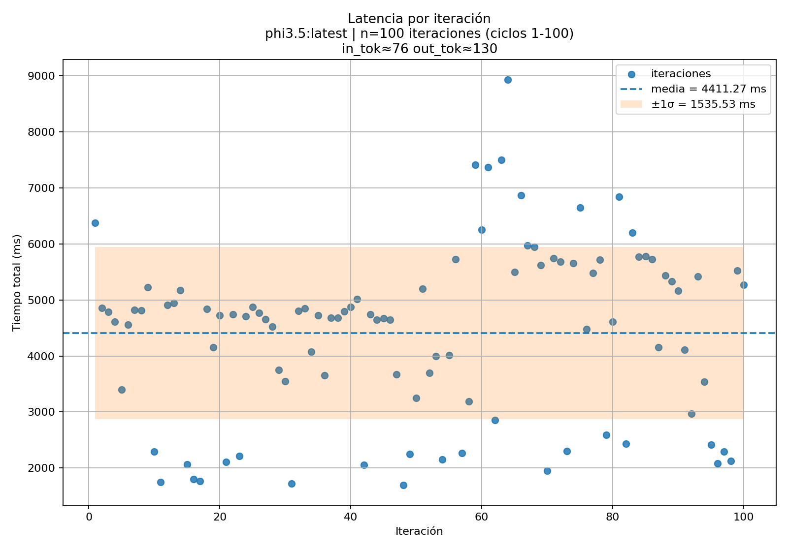
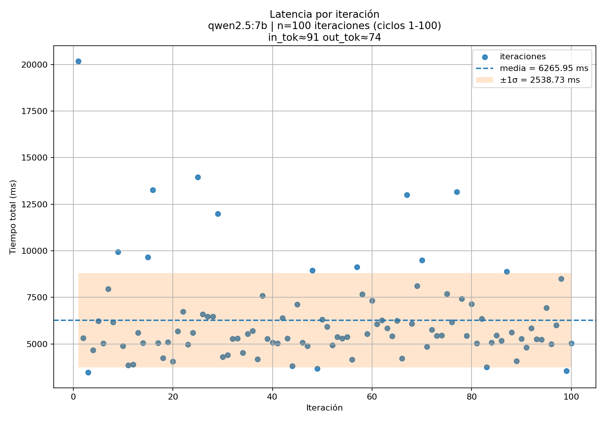
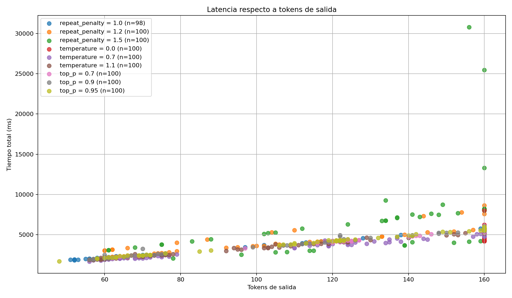

# Parte B — Benchmark de modelos

## Configuración del experimento

Se compararon tres modelos LLM ejecutados localmente con Ollama. Los tres recibieron el mismo prompt durante 100 ciclos cada uno, con parámetros de inferencia idénticos.

**Prompt utilizado:**
```
El usuario describió con voz: 'dibuja un perro sentado junto a una casa'.
Genera un JSON con exactamente estos campos: objects, layout, style, complexity.
Responde SOLO con el JSON, sin explicaciones, sin texto adicional, sin bloques de código.
```

**Parámetros base:**

| Parámetro | Valor |
|---|---|
| `temperature` | 0.7 |
| `top_p` | 0.9 |
| `top_k` | 40 |
| `num_predict` | 160 |
| `repeat_penalty` | 1.1 |
| `num_ctx` | 4096 |
| Ciclos por modelo | 100 |

---

## Resultados — Tabla comparativa

| Modelo | Tiempo promedio (s) | Tokens entrada | Tokens salida | Tokens/s | Calidad promedio | Justificación |
|---|---|---|---|---|---|---|
| `gemma3:4b` | 2.69 ± 1.91 | 65 | 45.92 ± 0.27 | 20.90 ± 2.99 | 10.0 / 10 | Calidad perfecta en todos los ciclos. Siempre generó JSON válido con los 4 campos. Respuestas más cortas y consistentes. Tiempo promedio más bajo del grupo. |
| `phi3.5:latest` | 4.41 ± 1.54 | 76 | 129.9 ± 39.07 | 30.78 ± 3.95 | 5.31 / 10 | El más rápido en tokens/s. Alta variabilidad en longitud (56–160 tokens): frecuentemente agrega texto fuera del JSON, lo que reduce su puntuación de calidad. |
| `qwen2.5:7b` | 6.27 ± 2.54 | 91 | 74.16 ± 26.93 | 12.40 ± 0.75 | 9.65 / 10 | Alta precisión en estructura JSON. El más lento por ser el modelo de mayor tamaño. Tokens/s muy estables (desviación estándar de 0.75). |

---

## Gráficas

### Latencia promedio por modelo


**Figura 1.** Gemma3:4b fue el modelo más rápido con 2.69 s promedio. Phi3.5 y qwen2.5 tienen mayor latencia pero por razones diferentes: phi genera más tokens por respuesta, qwen tiene más parámetros que procesar.

---

### Tokens por segundo


**Figura 2.** Phi3.5 lidera en tokens/s (30.78) seguido de gemma (20.90) y qwen (12.40). Sin embargo, generar más tokens por segundo no es ventaja cuando el modelo genera tokens innecesarios fuera del JSON requerido.

---

### Latencia por iteración — gemma3:4b


**Figura 3.** Gemma muestra un pico de latencia en los primeros ciclos (carga del modelo en memoria) y luego se estabiliza. La desviación estándar alta (1.91 s) se explica principalmente por esos picos iniciales.

---

### Latencia por iteración — phi3.5:latest



**Figura 4.** Phi3.5 presenta mayor variabilidad en latencia que gemma. Los picos corresponden a los ciclos donde generó respuestas de 160 tokens (límite de `num_predict`), es decir, donde no terminó el JSON de forma natural y siguió generando texto adicional.

---

### Latencia por iteración — qwen2.5:7b



**Figura 5.** Qwen muestra una curva de calentamiento más pronunciada en los primeros 5 ciclos, seguida de estabilización. Su baja desviación en tokens/s (0.75) confirma que una vez cargado es el modelo más predecible en rendimiento.

---

### Latencia vs tokens de salida



**Figura 6.** La correlación entre tokens de salida y latencia es clara en phi3.5: más tokens equivale a más tiempo. En gemma la correlación es casi nula porque sus respuestas son muy cortas y uniformes (45–46 tokens en prácticamente todos los ciclos).

---

### Boxplot de latencia


**Figura 7.** El boxplot confirma que gemma tiene la distribución de latencia más compacta. Phi y qwen presentan outliers en sus colas superiores.

---

## Análisis

**Gemma3:4b** fue el modelo con mayor calidad promedio (10/10) porque siempre generó JSON válido con los cuatro campos requeridos, sin texto adicional, y con la menor latencia del grupo (2.69 s). Sus respuestas son cortas, predecibles y parseable de forma confiable.

**Qwen2.5:7b** obtuvo calidad casi perfecta (9.65/10) con respuestas más elaboradas, pero al costo de ser el modelo más lento (6.27 s promedio). Su estabilidad en tokens/s lo hace predecible, pero su tamaño lo hace menos eficiente para el pipeline.

**Phi3.5:latest** es el más rápido en tokens/s pero su calidad fue la más baja (5.31/10) porque en muchos ciclos generó texto adicional fuera del JSON requerido, lo que hace su output menos confiable para procesamiento automatizado.

**Modelo seleccionado para el proyecto: `gemma3:4b`**

Para un pipeline de IA física donde la salida del LLM es procesada automáticamente por el sistema robótico, la confiabilidad del formato es más importante que la velocidad en tokens/s. Gemma3:4b garantiza JSON parseable en el 100% de los ciclos con el menor tiempo de respuesta del grupo, lo que lo convierte en la opción más adecuada.
