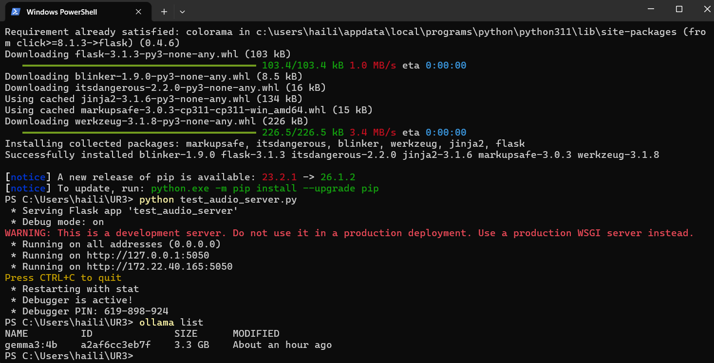
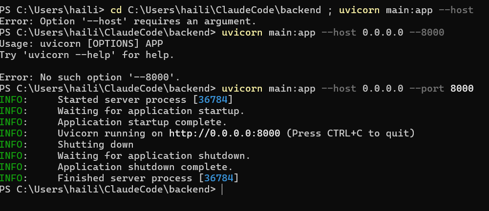
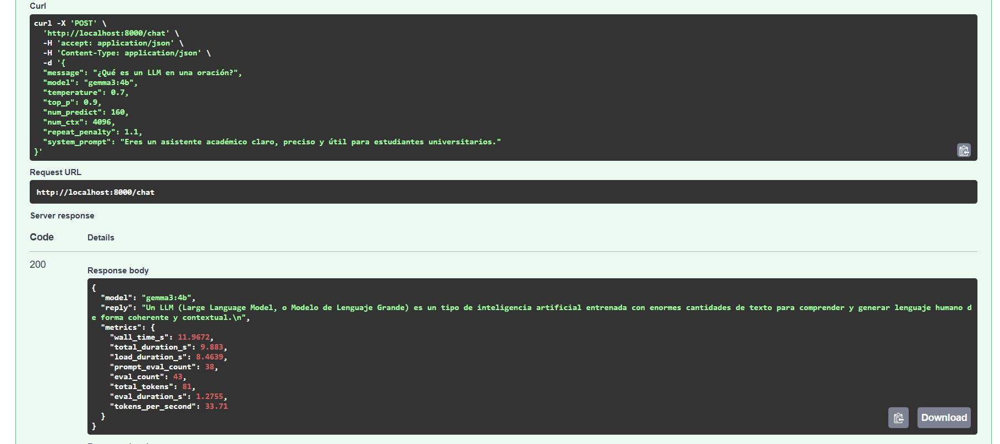
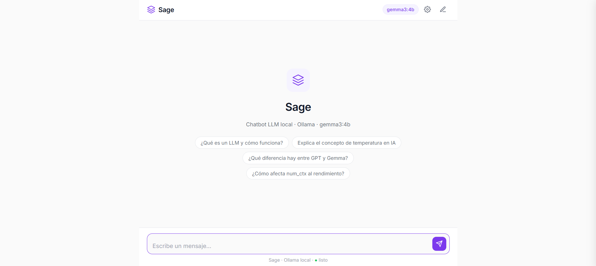
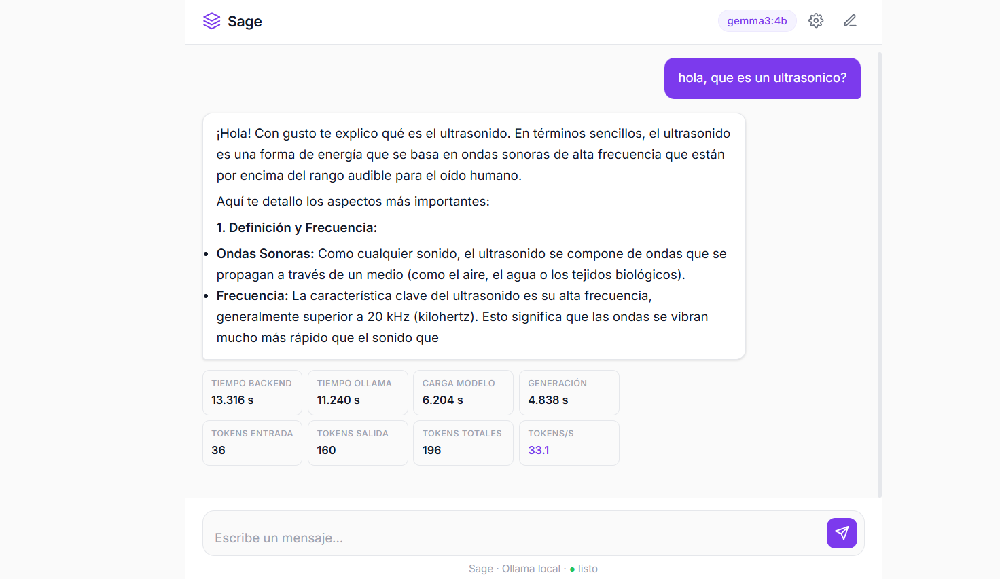

# Evidencias

Esta página documenta las capturas y salidas que verifican el funcionamiento completo del sistema.

---

## 1. Ollama con modelo instalado

Salida del comando `ollama list` que confirma que el modelo `gemma3:4b` está instalado localmente:

```
NAME         ID              SIZE      MODIFIED          
gemma3:4b    a2af6cc3eb7f    3.3 GB    About an hour ago
```

> El modelo ocupa 3.3 GB en disco. Se descargó con `ollama pull gemma3:4b`.



---

## 2. Backend ejecutándose

Salida de uvicorn al iniciar el servidor en `http://0.0.0.0:8000`:

```
INFO:     Started server process [56204]
INFO:     Waiting for application startup.
INFO:     Application startup complete.
INFO:     Uvicorn running on http://0.0.0.0:8000 (Press CTRL+C to quit)
```



---

## 3. Prueba del endpoint `/chat`

Petición de prueba realizada con Python `requests` directamente al endpoint `POST /chat`:

**Solicitud:**
```python
payload = {
    "message": "¿Qué es la temperatura en los LLM?",
    "model": "gemma3:4b",
    "num_predict": 80,
    "temperature": 0.7
}
requests.post("http://localhost:8000/chat", json=payload)
```

**Respuesta JSON completa:**
```json
{
  "model": "gemma3:4b",
  "reply": "La temperatura en los Modelos de Lenguaje Grandes (LLM) como ChatGPT es un parámetro crucial que controla la creatividad y aleatoriedad de las respuestas que genera el modelo...",
  "metrics": {
    "wall_time_s": 5.8913,
    "total_duration_s": 3.8046,
    "load_duration_s": 0.1957,
    "prompt_eval_count": 37,
    "eval_count": 80,
    "total_tokens": 117,
    "eval_duration_s": 2.4551,
    "tokens_per_second": 32.59
  }
}
```



---

## 4. Frontend funcionando

La interfaz Sage muestra el panel principal con el historial de conversación, el área de entrada de texto y el indicador de estado.



---

## 5. Métricas visibles en el frontend

Después de cada respuesta del modelo, el grid de 8 métricas aparece debajo de la burbuja del asistente. Muestra tiempos en segundos, conteos de tokens y velocidad de generación.



---

## Documentación de la API interactiva

FastAPI genera automáticamente documentación Swagger en `http://localhost:8000/docs`:


