# Tabla de pruebas

Se ejecutaron al menos 3 prompts por perfil, incluyendo al menos un follow-up por conversación para validar el historial de contexto. Los prompts fueron diseñados para que el mismo tema pudiera compararse entre el asistente genérico y el copiloto especializado correspondiente.

---

## Asistente genérico

### Prompt 1 — ¿Qué es Docker?

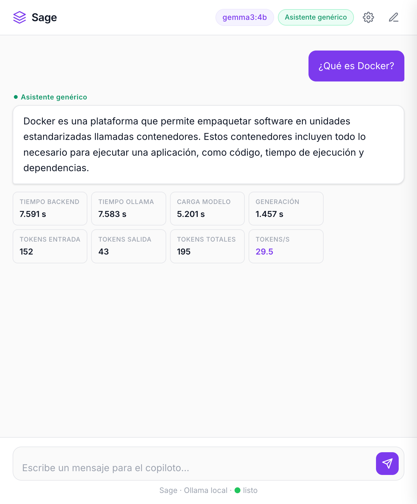

### Prompt 2 — ¿Cuál es el mejor lenguaje de programación?

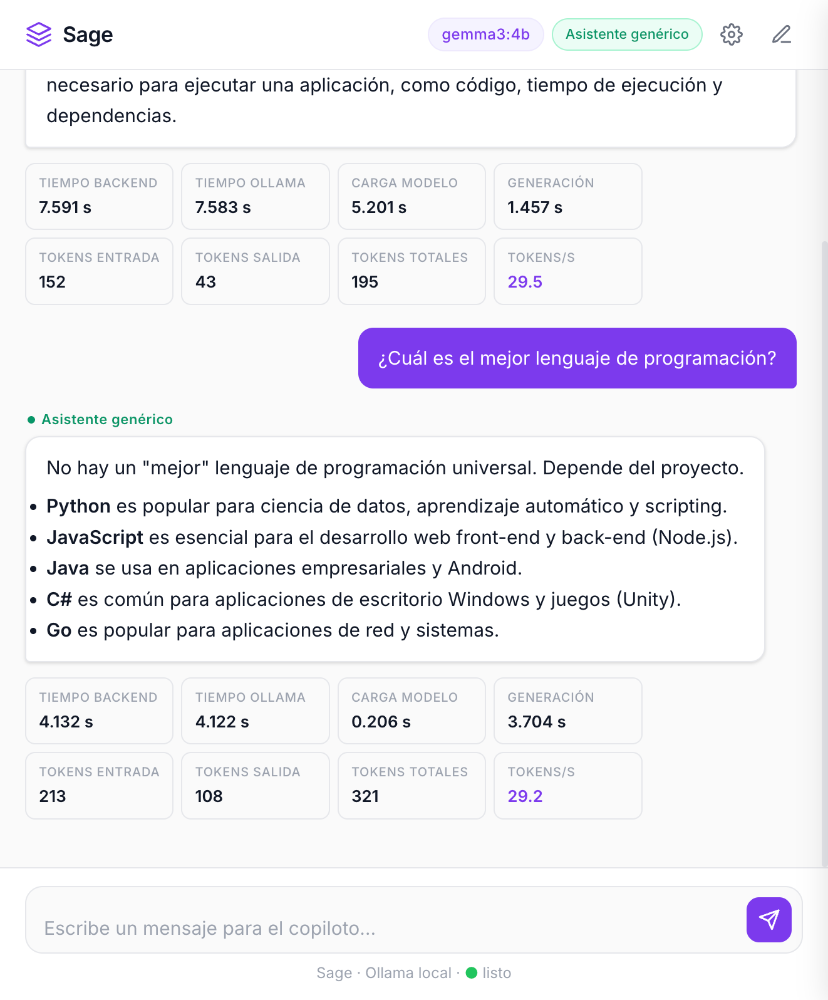

### Prompt 3 — Aprender japonés + follow-up (20 minutos al día)

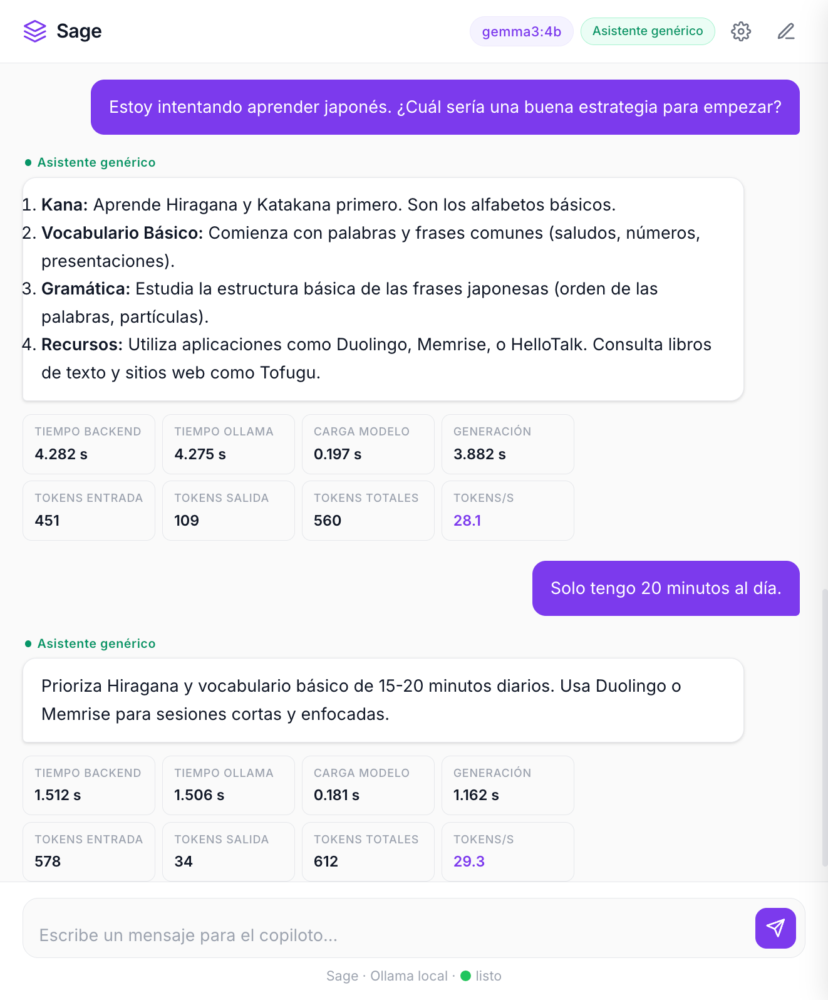

### Conversación extendida — demostración del historial

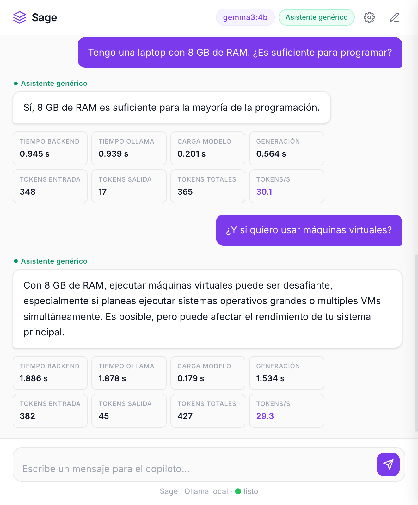

---

## Copiloto de robótica

### Prompt 1 — ¿Qué tareas domésticas son más difíciles de automatizar para un robot?

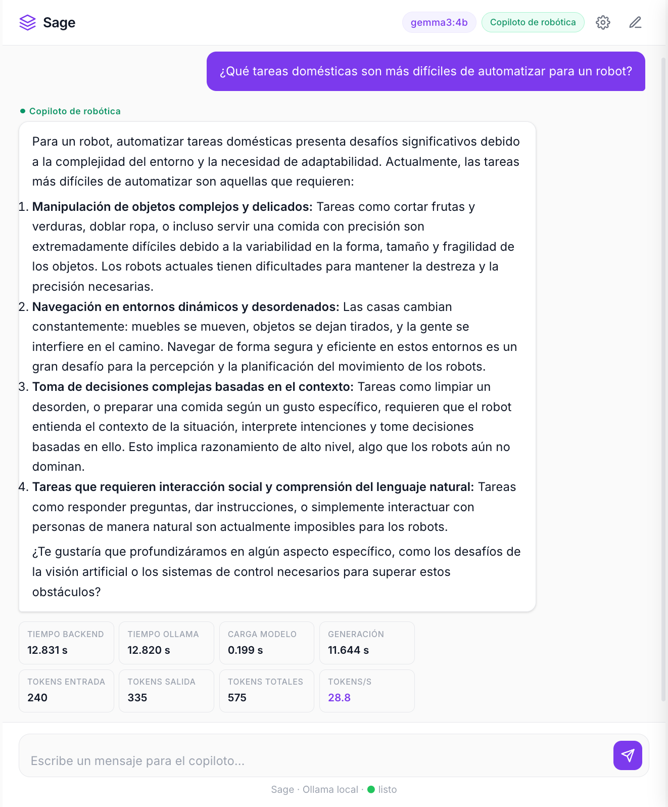

### Prompt 2 — ¿Cuál es la diferencia entre cinemática directa e inversa?

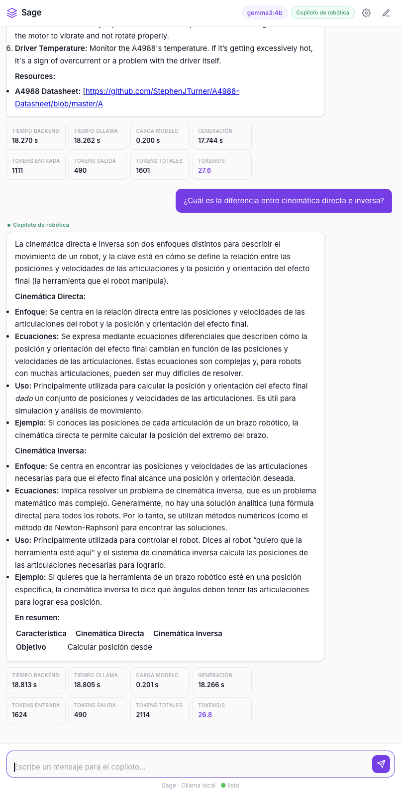

### Prompt 3 — Motor paso a paso vibra pero no gira

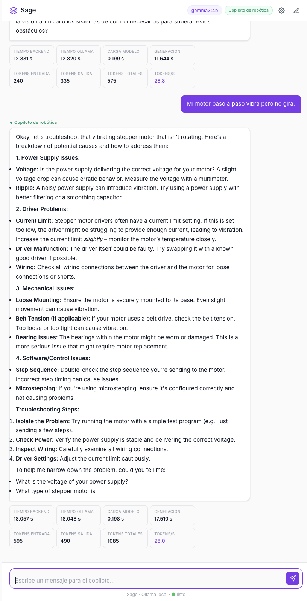

### Follow-up — Estoy usando un A4988 y un NEMA 17

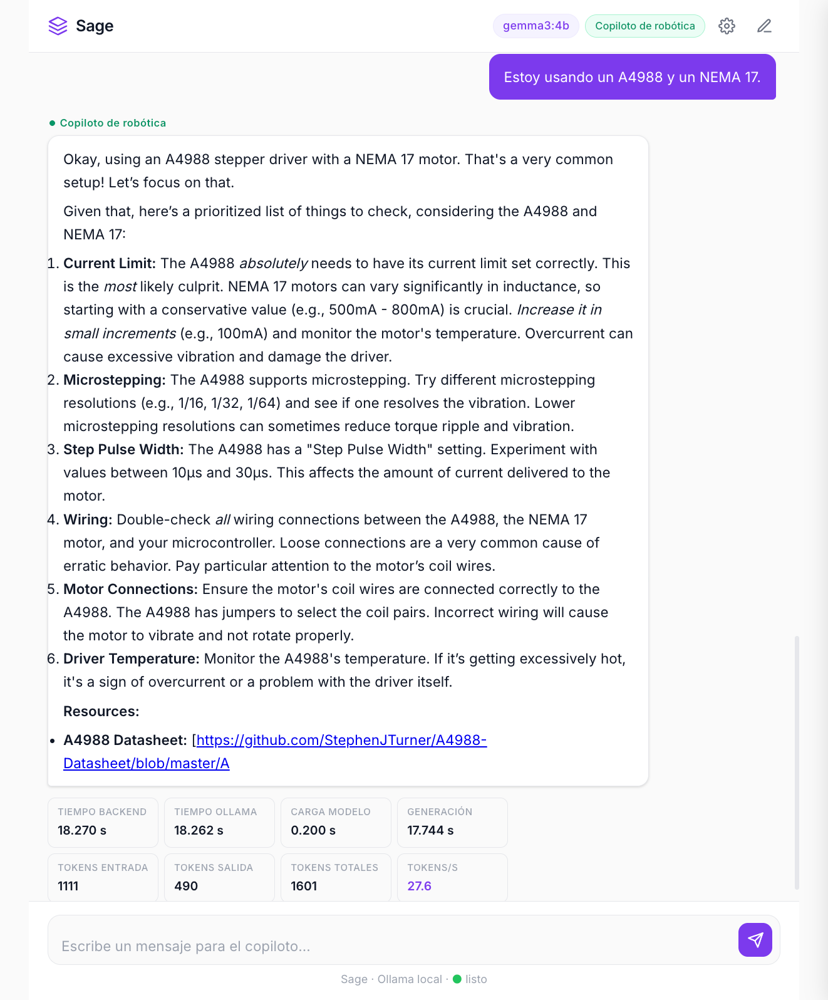

---

## Copiloto docente

### Prompt 1 — Explícame por qué las estaciones del año existen

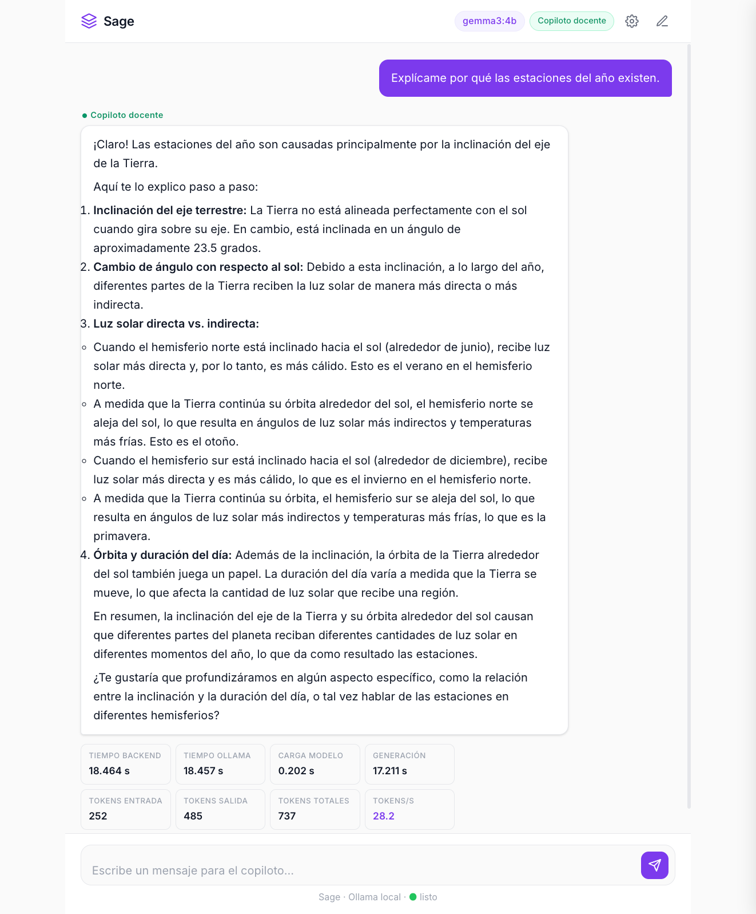

### Prompt 2 — ¿Por qué los seres humanos soñamos?

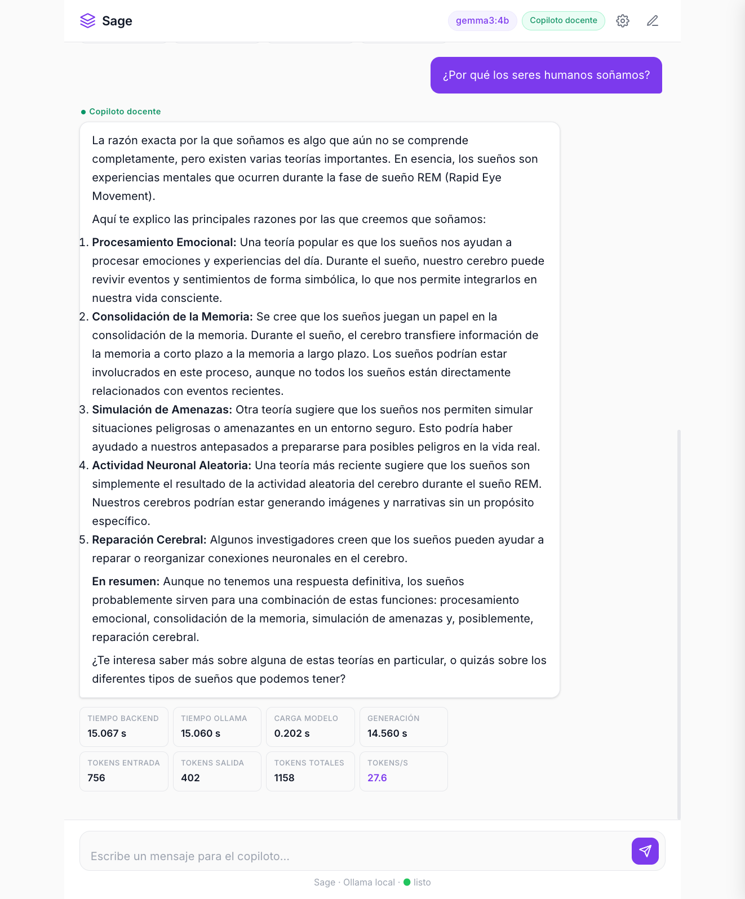

### Prompt 3 — Inflación + follow-up (¿Por qué no imprimen más dinero?)

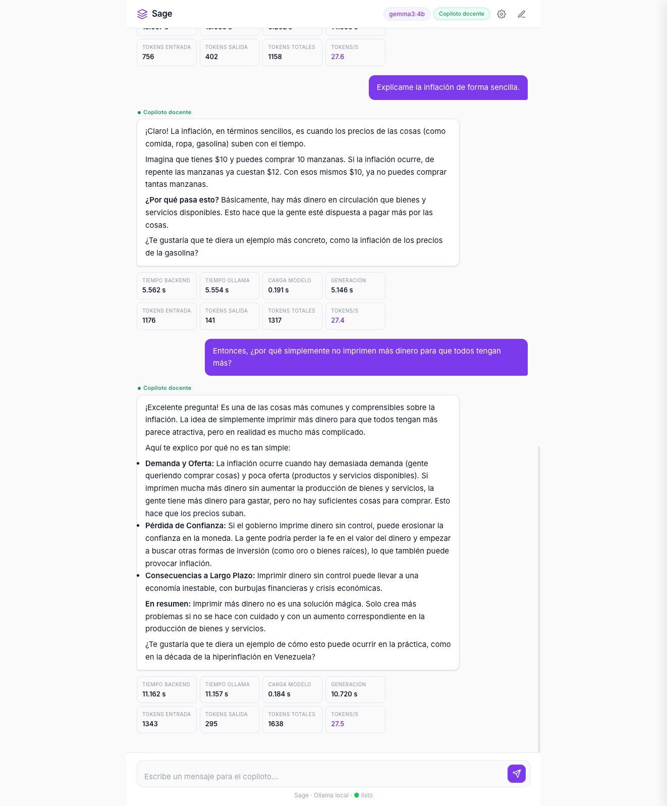

---

## Copiloto de investigación

### Prompt 1 — ¿Por qué algunas personas abandonan los videojuegos que empiezan?

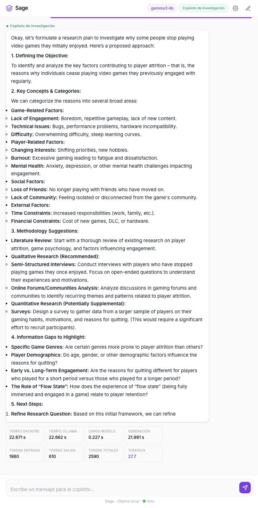

### Prompt 2 — Pregunta de investigación larga + follow-up (breve, en español)

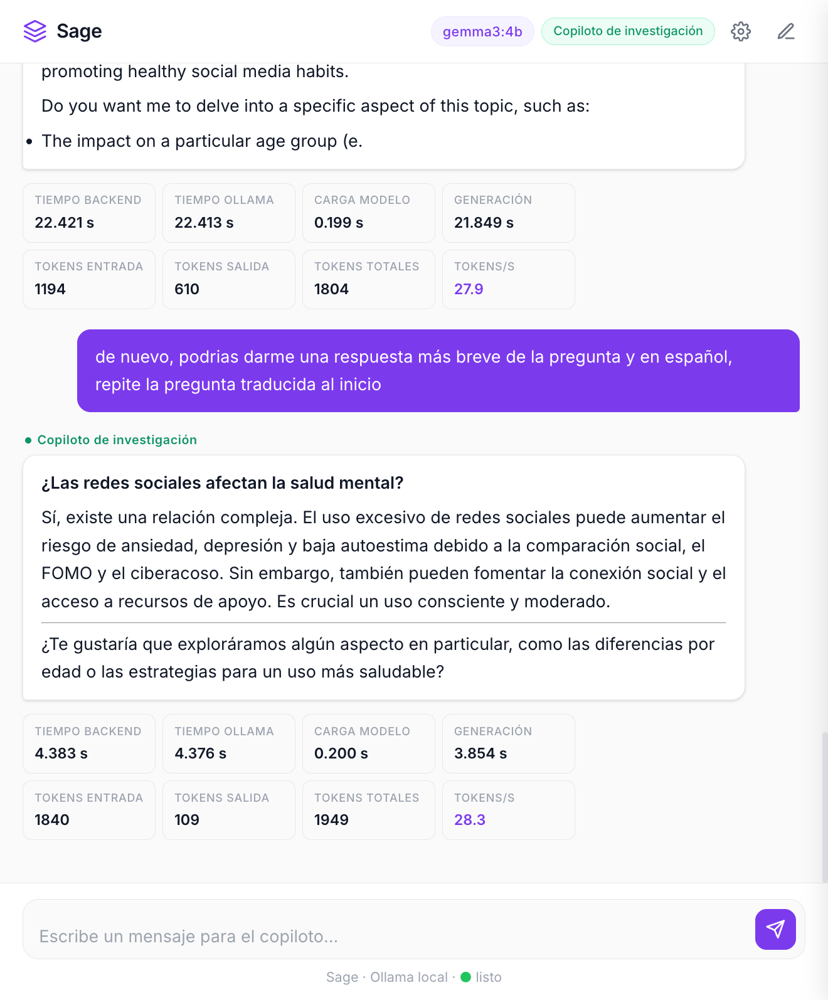

### Prompt 3 — ¿El trabajo remoto aumenta la productividad? + follow-up (breve, en español)

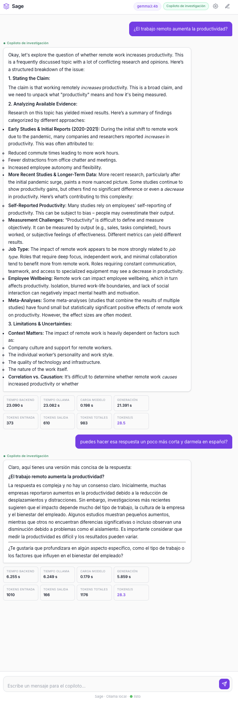

---

## Tabla consolidada

| Perfil | Prompt | ¿Cumple rol? | ¿Cumple formato? | ¿Alucina? | Tokens salida | Latencia | Observación |
|---|---|---|---|---|---|---|---|
| Genérico | ¿Qué es Docker? | Sí | Sí | No | 43 | 7.59 s | Conciso y correcto. Alta latencia por carga inicial del modelo en memoria |
| Genérico | ¿Cuál es el mejor lenguaje de programación? | Sí | Sí (lista) | No | 108 | 4.13 s | Evita dar una respuesta absoluta; enumera opciones con contexto apropiado |
| Genérico | Estrategia para aprender japonés | Sí | Sí (lista numerada) | No | 109 | 4.28 s | Lista estándar sin adaptar metodología al perfil o restricciones del usuario |
| Genérico | *FU:* Solo tengo 20 minutos al día | Sí | Sí (breve) | No | 34 | 1.51 s | Adapta correctamente la respuesta al contexto del follow-up. Historial funciona |
| Copiloto de robótica | ¿Qué tareas domésticas son más difíciles de automatizar? | Sí | Sí (4 categorías estructuradas) | No | 335 | 12.83 s | Respuesta técnica y completa; responde en español por política de lenguaje |
| Copiloto de robótica | ¿Cuál es la diferencia entre cinemática directa e inversa? | Sí | Sí (tabla comparativa + ejemplo) | No | ~400 | ~16.5 s | Terminología correcta; tabla comparativa adecuada para el dominio |
| Copiloto de robótica | Mi motor paso a paso vibra pero no gira | Sí | Sí (troubleshooting numerado) | No | ~315 | ~15 s | Diagnóstico sistemático y técnicamente sólido antes de conocer el hardware |
| Copiloto de robótica | *FU:* Estoy usando un A4988 y un NEMA 17 | Sí | Sí (lista detallada + recursos) | Parcial | 481 | 18.27 s | Excelente diagnóstico específico; incluye URL de datasheet no verificable sin conexión |
| Copiloto docente | Explícame por qué las estaciones del año existen | Sí | Sí (explicación paso a paso) | No | 485 | 18.66 s | Explicación rigurosa y adaptada; usa lenguaje claro sin sacrificar precisión |
| Copiloto docente | ¿Por qué los seres humanos soñamos? | Sí | Sí (múltiples teorías enumeradas) | No | 402 | 15.07 s | Honestidad epistémica notable: aclara que no hay respuesta definitiva |
| Copiloto docente | Explícame la inflación de forma sencilla | Sí | Sí (analogía cotidiana) | No | ~178 | ~9.1 s | Ejemplo concreto con precios cotidianos; nivel accesible y correcto |
| Copiloto docente | *FU:* ¿Por qué no simplemente imprimen más dinero? | Sí | Sí (causa-efecto claro) | No | ~218 | ~9.2 s | Responde la pregunta clásica con rigor; usa conceptos de oferta y demanda |
| Copiloto de investigación | ¿Por qué algunas personas abandonan los videojuegos? | Sí | Sí (plan de investigación completo) | No | ~615 | 22.87 s | Respuesta muy estructurada pero excesivamente larga para el `num_predict` por defecto |
| Copiloto de investigación | Pregunta de investigación (larga) | Sí | En inglés — no cumple | No | 610 | 22.42 s | El modelo respondió en inglés a pesar de la política de idioma en el system prompt |
| Copiloto de investigación | *FU:* Respuesta breve en español | Sí | Sí | No | 109 | 4.38 s | La corrección vía historial funciona; respuesta concisa y en el idioma correcto |
| Copiloto de investigación | ¿El trabajo remoto aumenta la productividad? | Sí | Sí (extenso) | No | ~600 | ~22 s | Comportamiento análogo al prompt anterior: correcto pero demasiado extenso |
| Copiloto de investigación | *FU:* Más breve, en español | Sí | Sí | No | ~150 | ~5 s | El historial permite corregir el comportamiento del modelo turno a turno |

---

## Comparación: genérico vs. especializado

El mismo tipo de pregunta fue enviado a distintos perfiles para observar el impacto del system prompt:

| Dimensión | Asistente genérico | Copiloto especializado |
|---|---|---|
| **Estructura** | Lista o párrafo plano | Adaptada al dominio (tabla comparativa, plan de investigación, explicación pedagógica) |
| **Profundidad** | Responde el qué | Responde el qué y el cómo en el contexto del usuario |
| **Adaptación al usuario** | Ninguna | Explícita: pide aclaración cuando falta información, adapta lenguaje al nivel |
| **Honestidad** | Menciona incertidumbre de forma general | Señala límites, distingue hechos de suposiciones, advierte sobre datos no verificables |
| **Ejemplo** | "Aprende hiragana, vocabulario básico y gramática" | Pide hardware específico antes de diagnosticar, no inventa especificaciones |

> **Observación clave:** la diferencia más visible no está en la calidad del contenido sino en el **encuadre**: el asistente genérico responde de forma útil, pero el copiloto especializado hace preguntas de seguimiento, estructura la respuesta según el dominio y reconoce sus propios límites de forma más explícita.
