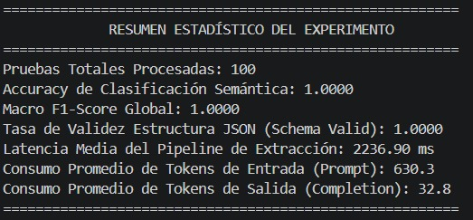
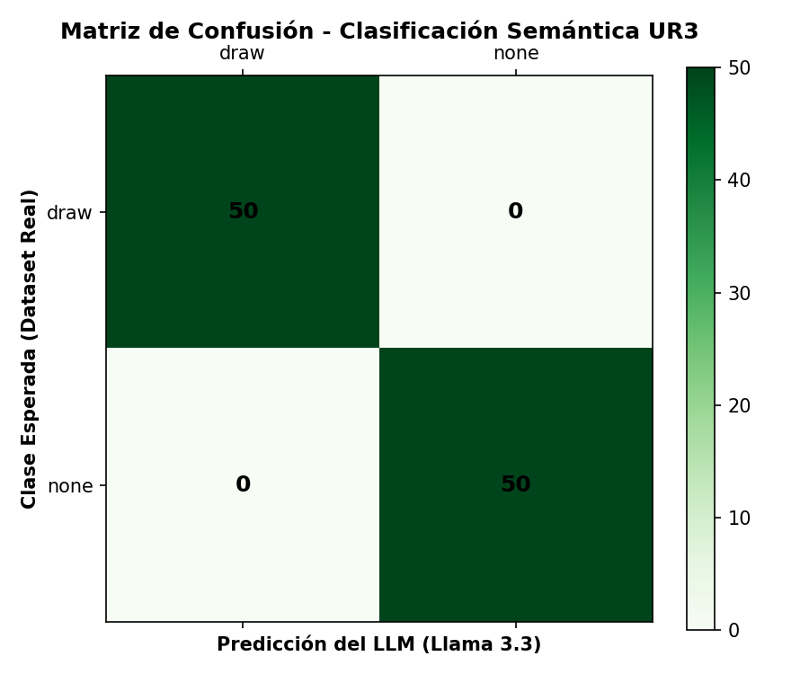

# Pruebas y métricas

Se ejecutaron 100 pruebas cíclicas (50 `draw` / 50 `none`) contra `llama-3.3-70b-versatile` vía Groq Cloud API, con `temperature = 0.1` y `response_format = json_object`.

---

## Resumen estadístico del experimento

| Indicador | Valor |
| --- | --- |
| Pruebas totales procesadas | 100 |
| Accuracy de clasificación semántica | 1.0000 |
| Macro F1-score global | 1.0000 |
| Tasa de validez de esquema JSON (`schema_valid`) | 1.0000 |
| Latencia media del pipeline de extracción | 2236.90 ms |
| Tokens de entrada promedio (prompt) | 630.3 |
| Tokens de salida promedio (completion) | 32.8 |

---

## Reporte de clasificación (`classification_report.csv`)

| Clase | precision | recall | f1-score | support |
| --- | --- | --- | --- | --- |
| `draw` | 1.00 | 1.00 | 1.00 | 50 |
| `none` | 1.00 | 1.00 | 1.00 | 50 |
| **accuracy** |  |  | **1.00** | 100 |
| macro avg | 1.00 | 1.00 | 1.00 | 100 |
| weighted avg | 1.00 | 1.00 | 1.00 | 100 |

- **precision:** de todas las veces que el modelo predijo `draw`, qué proporción realmente era `draw`. En 1.00, cero falsas alarmas.
- **recall:** de todas las instrucciones de dibujo reales, cuántas detectó el modelo. En 1.00, ninguna instrucción válida fue ignorada.
- **f1-score:** media armónica entre precision y recall; balancea detectar bien contra evitar falsas activaciones.
- **support:** número de muestras reales de cada clase en el dataset (50 y 50).

---

## Matriz de confusión

| Esperado \ Predicho | `draw` | `none` |
| --- | --- | --- |
| `draw` | 50 | 0 |
| `none` | 0 | 50 |

- **Verdaderos positivos (`draw → draw`) = 50:** el modelo identificó el 100 % de las intenciones de dibujo legítimas, incluyendo estructuras complejas y autocorrecciones (*"pinta una manzana roja... no mejor dibuja un coche azul"*).
- **Verdaderos negativos (`none → none`) = 50:** el modelo discriminó el 100 % del ruido sintáctico: pláticas casuales, preguntas teóricas sobre MQTT/robótica y pruebas de calibración de micrófono se mapearon correctamente a `none`.
- **Falsos positivos y falsos negativos = 0:** no hubo errores tipo I (ruido clasificado como dibujo) ni tipo II (orden de dibujo ignorada).

---

## Latencia

| Estadístico | Valor |
| --- | --- |
| Media | 2236.90 ms |
| Mínimo | 328.15 ms |
| P50 (mediana) | 2555.84 ms |
| P95 | 3640.23 ms |
| P99 | 3764.02 ms |
| Máximo | 4096.89 ms |

A diferencia de una latencia estrictamente estable, el rango observado (328 ms – 4097 ms) muestra una dispersión real: el P95 y el máximo están cerca de **1.6× – 1.8×** la media, no "a unos milisegundos" de ella. Esto es consistente con llamadas a una API remota (Groq) donde la latencia de red y la cola de inferencia varían trial a trial. Para *control en tiempo real estricto* sobre el UR3 esta variabilidad importa: un comando podría tardar 4 veces más que otro sin previo aviso. Para *procesamiento por lotes* (batch), como se usó aquí, el promedio de ~2.2 s es aceptable.

---

## Instrumento de supervisión humana (`instrumento_supervision_llm_led.xlsx`)

El instrumento agrega, sobre las 100 filas del experimento, cuatro columnas para revisión humana independiente del criterio automático:

| Columna | Uso |
| --- | --- |
| `accion_correcta_supervisor` | Acción correcta según el supervisor (`draw` / `none`) |
| `evaluacion_supervisor` | `correcto`, `parcial`, `incorrecto` o `no evaluado` |
| `calidad_1_5` | Calificación subjetiva de la calidad de la extracción |
| `observaciones_supervisor` | Comentarios libres |

**Resultado de la revisión supervisada:** las 100 filas fueron marcadas `evaluacion_supervisor = correcto`, con `calidad_1_5 = 5` en todos los casos, y `accion_correcta_supervisor` coincide con `llm_action` en el 100 % de las filas (0 discrepancias entre el criterio automático y el humano). Esto confirma, desde una segunda capa de evaluación independiente del cálculo de `scikit-learn`, que el resultado de accuracy = 1.0000 no es un artefacto del script de métricas.

> Ver la nota metodológica sobre el tamaño real del banco de pruebas (20 enunciados únicos repetidos 5 veces) en [Código de evaluación](): la revisión humana confirma que el modelo es consistente ante la misma entrada, pero no sustituye una prueba de generalización con paráfrasis nuevas.
