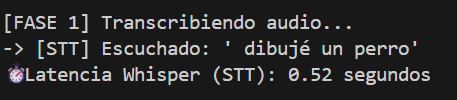
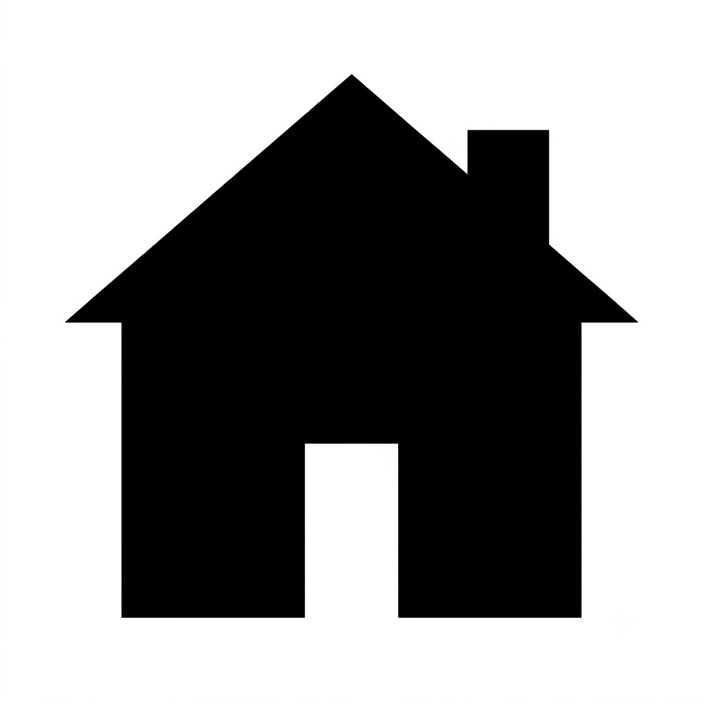
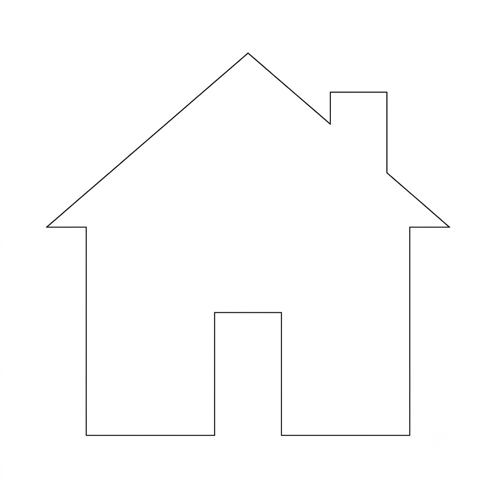
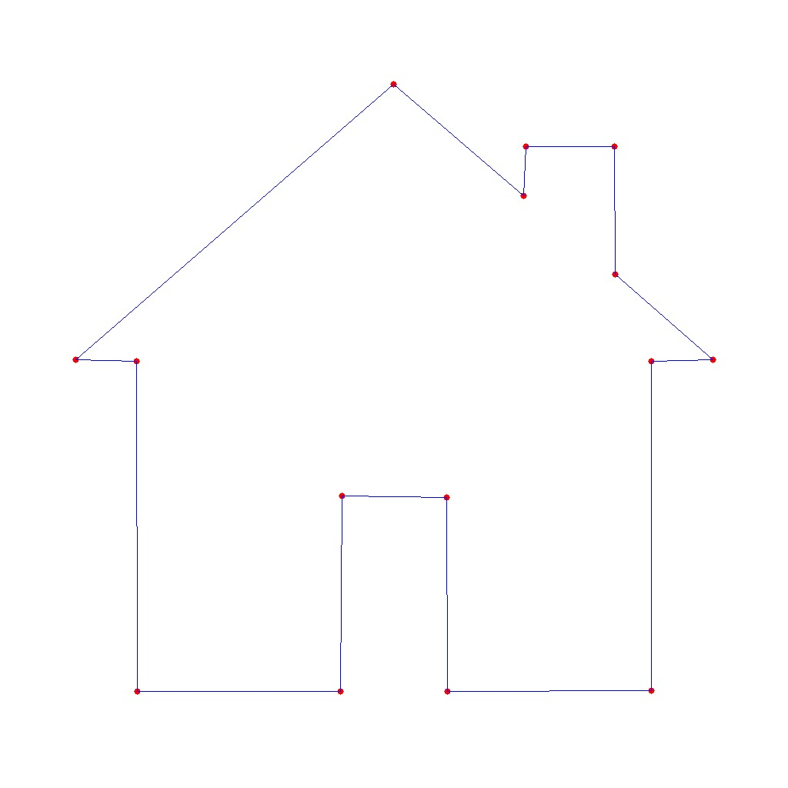

# Implementación del Proyecto

Para entender cómo funciona este proyecto sin necesidad de conocimientos en programación, podemos imaginar que nuestro sistema es como **un restaurante altamente coordinado**. En este restaurante, el cliente es el usuario humano, y el objetivo final es entregar un platillo muy específico: un dibujo físico en un pizarrón.

Así es como trabaja el equipo paso a paso:

## 1. El Cliente y el Mesero (Meta Quest 3 y Whisper)
Todo comienza cuando el cliente hace un pedido usando su voz a través de las gafas de realidad virtual. Sin embargo, el resto del equipo solo entiende instrucciones escritas. Aquí entra **Whisper**, que actúa como un mesero con un oído perfecto. Su única tarea es escuchar atentamente el audio y transcribirlo a texto exacto en una libreta.

## 2. El Gerente del Restaurante (Llama 3.3)
La libreta con el texto pasa a **Llama 3.3**, nuestro gerente. Él lee el texto y extrae únicamente la información vital. Si el cliente dijo un párrafo largo sobre cómo quiere un perro, el gerente filtra la charla y escribe una orden de cocina estructurada y formal que dice: "Sujeto: Perro".

## 3. El Artista Gráfico (OpenAI / DALL-E)
La orden estructurada llega al artista del equipo. Su tarea es imaginar cómo se ve ese perro y generar un boceto visual en blanco y negro. Este artista es extremadamente talentoso y rápido, pero se toma su tiempo (unos 14 segundos) para asegurarse de que el dibujo sea claro y tenga un solo trazo continuo.

## 4. El Cartógrafo (OpenCV)
El dibujo generado es hermoso, pero el robot no sabe cómo "ver" imágenes. Aquí interviene **OpenCV**, actuando como un cartógrafo. Toma la imagen y calca los bordes, convirtiendo las líneas del dibujo en un mapa de coordenadas matemáticas (puntos X y Y). Ahora, el dibujo ya no es una imagen, es un mapa del tesoro con indicaciones paso a paso.

## 5. El Constructor (Brazo Robótico UR3)
Finalmente, el mapa de coordenadas se envía al **UR3**, un brazo robótico industrial. El robot actúa como un constructor a ciegas; no sabe qué está dibujando, simplemente sigue las coordenadas del mapa con absoluta precisión milimétrica usando un plumón sobre el pizarrón. 

Gracias a esta cadena de trabajo en equipo, la voz humana se transforma en una acción física en el mundo real.