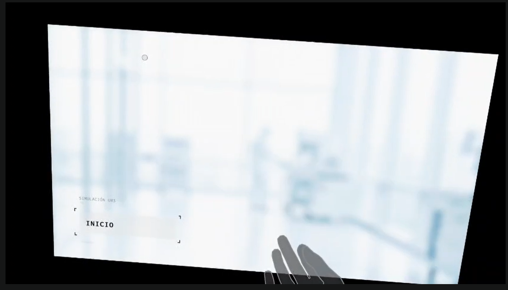
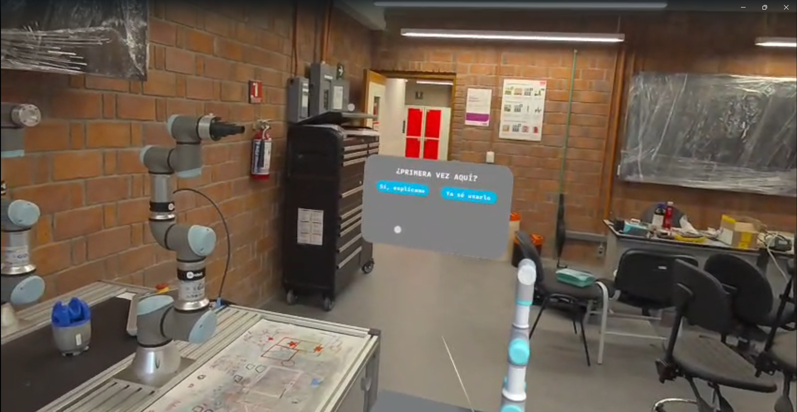
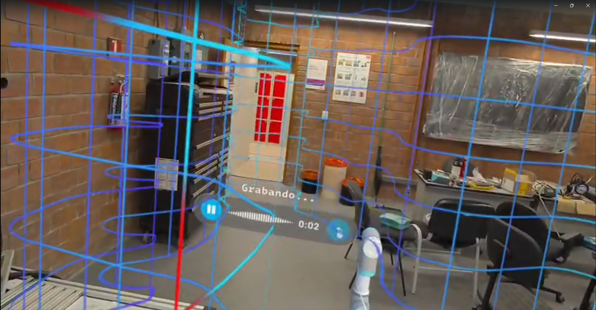
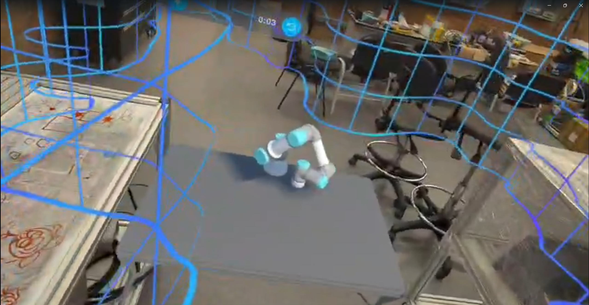
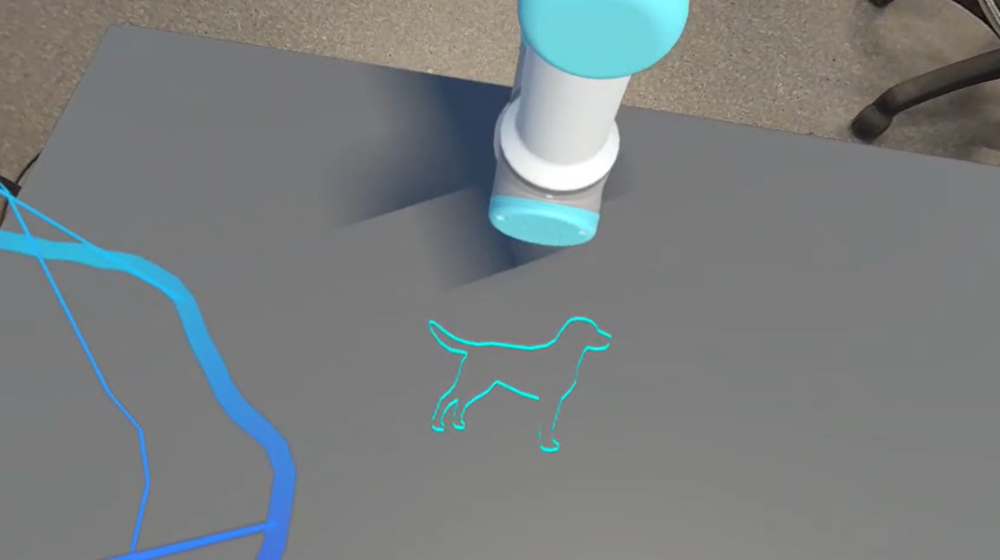
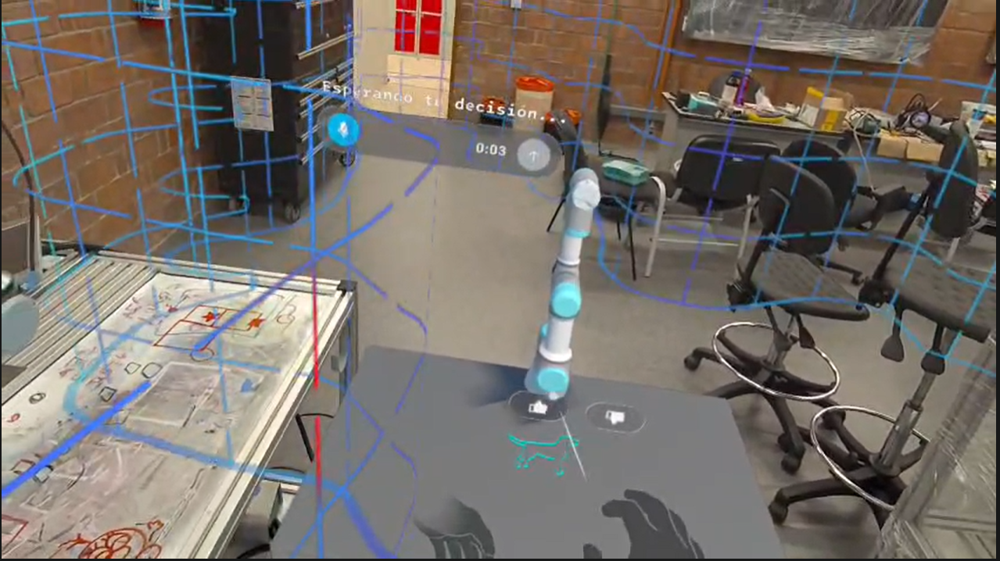

# Pruebas Físicas y Flujo de Interfaz en Realidad Mixta

Para validar el funcionamiento de la arquitectura, se realizaron diversas pruebas físicas utilizando las gafas Meta Quest 3. A continuación, se documenta paso a paso la experiencia del usuario al interactuar con el sistema, desde el inicio de la aplicación hasta la autorización de la ejecución final en el brazo robótico UR3.

## 1. Pantalla de Inicio
El flujo comienza con una interfaz minimalista en el entorno de realidad mixta. El usuario debe interactuar con el botón de **INICIO** utilizando el seguimiento de manos (*hand tracking*) de las gafas para arrancar el sistema.

## 2. Modal de Tutorial
Una vez iniciado el programa, el sistema despliega un menú interactivo preguntando al usuario si es su primera vez utilizando la aplicación. Esto permite ofrecer un recorrido guiado para nuevos usuarios o, en su defecto, saltar directamente a la acción para usuarios experimentados.

## 3. Captura de la Solicitud (Grabación)
Tras superar la pantalla de bienvenida, se activa el micrófono de las Meta Quest 3. Una interfaz visual indica que el sistema está "Grabando...", momento en el cual el usuario dicta su solicitud en lenguaje natural. Este archivo de audio es el que viaja a través de la red hacia el servidor backend para iniciar el *pipeline* de Inteligencia Artificial.

## 4. Simulación del Trazo en el Gemelo Digital
Una vez que el servidor procesa el audio, la Inteligencia Artificial genera las coordenadas espaciales y las devuelve a las gafas. El Gemelo Digital (el brazo UR3 virtual renderizado en Unity) comienza a moverse, trazando el dibujo solicitado sobre una superficie de previsualización holográfica. Esto permite al usuario ver exactamente qué entendió el sistema antes de gastar recursos físicos.

## 5. Resultado de la Generación
En esta etapa, el usuario puede observar el resultado final del dibujo en el entorno virtual. En este caso de prueba, la Inteligencia Artificial interpretó correctamente la instrucción y generó el contorno continuo de un perro, segmentado y vectorizado adecuadamente.

## 6. Panel de Decisión y Ejecución Física
Finalmente, el sistema presenta un panel flotante de confirmación ("Esperando tu decisión...") con opciones de aprobación o rechazo. Si el usuario está satisfecho con la previsualización del Gemelo Digital y aprueba el resultado, se envía la instrucción de movimiento definitiva hacia el controlador del **brazo robótico UR3 físico**, el cual procede a realizar el dibujo con el plumón en el entorno real.

## 7. Video de funcionamiento de proyecto
Se muestra un video de como funciona el proyecto en las gafas Meta Quest 3 sobre el gemelo digital del brazo UR3

<iframe 
    width="100%" 
    height="500" 
    src="https://www.youtube.com/embed/uPoKG8aupS8" 
    title="Pruebas físicas UR3" 
    frameborder="0" 
    allow="accelerometer; autoplay; clipboard-write; encrypted-media; gyroscope; picture-in-picture" 
    allowfullscreen>
</iframe>
