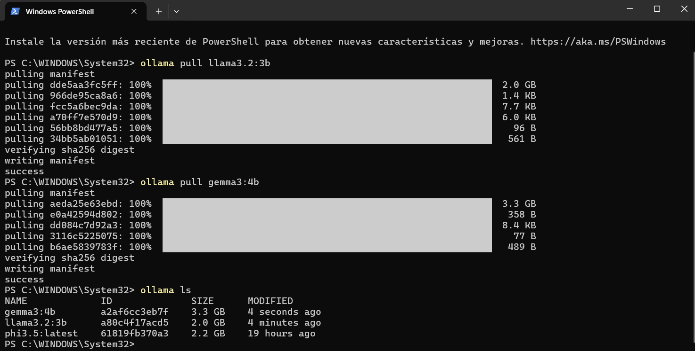

# Práctica 1 — Instalación, ejecución y comparación de modelos LLM locales

Esta práctica corresponde a la asignatura **Prospectiva de la Tecnología** (IE127), impartida en la Universidad Iberoamericana Ciudad de México durante el verano 2026.

El objetivo es instalar Ollama, ejecutar seis modelos LLM locales con los mismos cuatro prompts, comparar su desempeño y documentar los hallazgos.

---

## Modelos utilizados

Los seis modelos se descargaron con Ollama desde PowerShell:

```
ollama pull llama3.2:3b
ollama pull gemma3:4b
ollama pull phi3.5:latest
ollama pull qwen2.5:7b
ollama pull mistral:7b
ollama pull tinyllama:1.1b-chat-v1-q8_0
```

## Verificación con `ollama ls`



**Figura 1.** Salida de `ollama ls` mostrando los modelos descargados con su identificador y tamaño en disco.

| Modelo | Tamaño en disco |
|---|---|
| `gemma3:4b` | 3.3 GB |
| `llama3.2:3b` | 2.0 GB |
| `phi3.5:latest` | 2.2 GB |
| `qwen2.5:7b` | 4.7 GB |
| `mistral:7b` | 4.1 GB |
| `tinyllama:1.1b-chat-v1-q8_0` | 1.2 GB |
