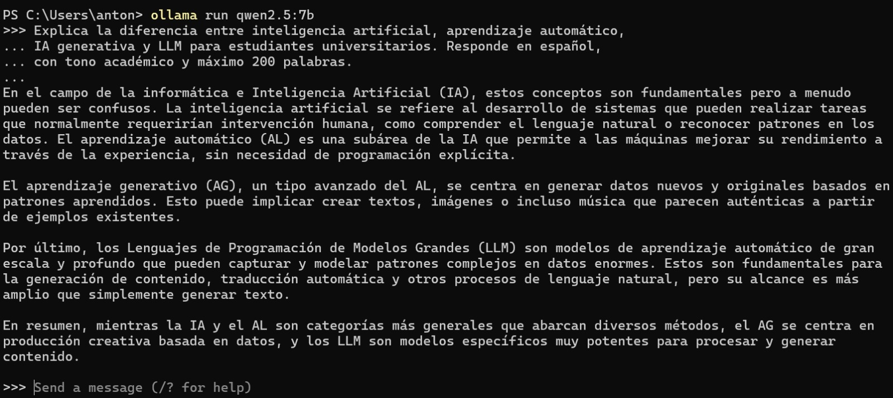
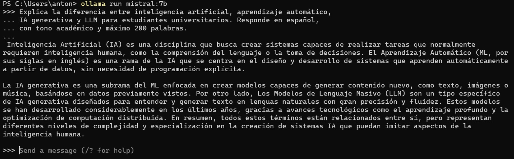
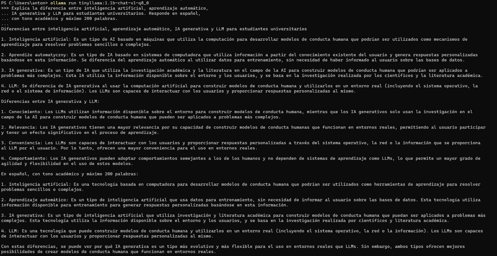

# Prompt 1 — Explicación conceptual

## Prompt utilizado

```
Explica la diferencia entre inteligencia artificial, aprendizaje automático,
IA generativa y LLM para estudiantes universitarios. Responde en español,
con tono académico y máximo 200 palabras.
```

---

## llama3.2:3b


**Figura 1.** Respuesta de `llama3.2:3b` al prompt 1.

Estructuró la respuesta en cuatro párrafos diferenciados, uno por concepto. Mantuvo tono académico y respetó el límite de palabras. El español fue correcto y fluido.

---

## phi3.5:latest


**Figura 2.** Respuesta de `phi3.5:latest` al prompt 1.

Respondió en un solo bloque continuo e indicó el conteo de palabras al final: 198. Su redacción fue más densa y técnica, aunque igualmente coherente. Fue el único que acusó recibo explícito del límite de palabras.

---

## gemma3:4b


**Figura 3.** Respuesta de `gemma3:4b` al prompt 1.

Estructuró la respuesta con párrafos por concepto. Fue el más conciso, con frases breves y directas. Su tono fue más divulgativo que académico, aunque perfectamente comprensible.

---

## qwen2.5:7b



**Figura 4.** Respuesta de `qwen2.5:7b` al prompt 1.

Respondió en cuatro párrafos fluidos con buena progresión conceptual. El español fue natural. Usó las abreviaturas AL y AG de forma consistente. No excedió el límite de palabras solicitado.

---

## mistral:7b



**Figura 5.** Respuesta de `mistral:7b` al prompt 1.

Respondió con dos párrafos bien estructurados. Fue el más conciso de los modelos de 7B pero también el más preciso en la relación jerárquica entre conceptos. Mencionó el aprendizaje profundo como parte de la cadena. El español fue correcto con las siglas en inglés debidamente aclaradas.

---

## tinyllama:1.1b-chat-v1-q8_0



**Figura 6.** Respuesta de `tinyllama:1.1b-chat-v1-q8_0` al prompt 1.

Fue el modelo con la respuesta más larga y menos precisa. Respondió en español pero mezcló conceptos incorrectamente y superó el límite de 200 palabras. Es el ejemplo más claro de las limitaciones de los modelos de 1B parámetros para tareas de precisión conceptual.
