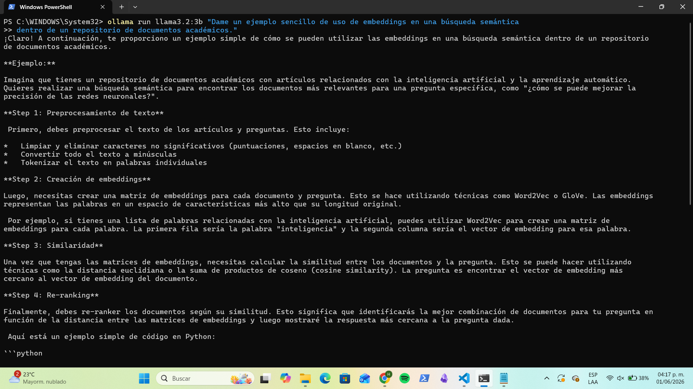
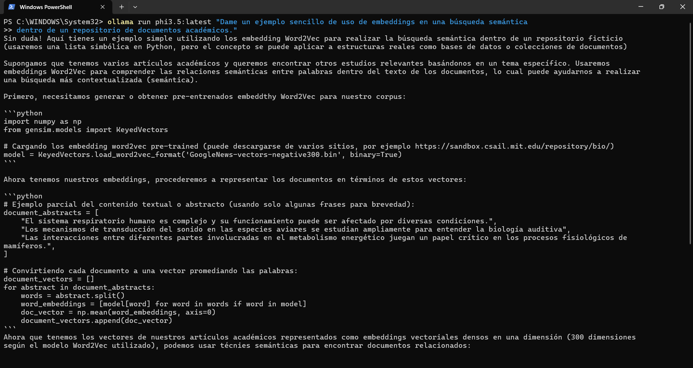
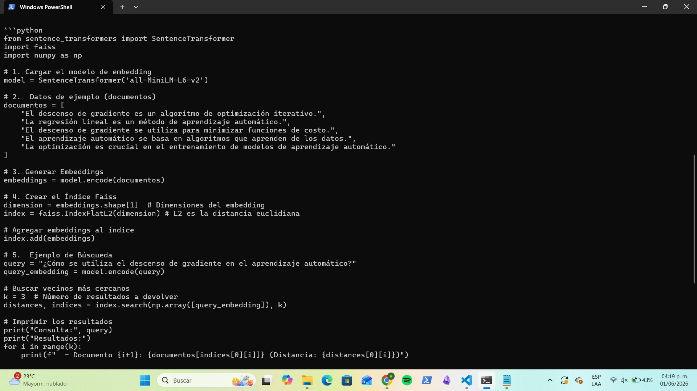
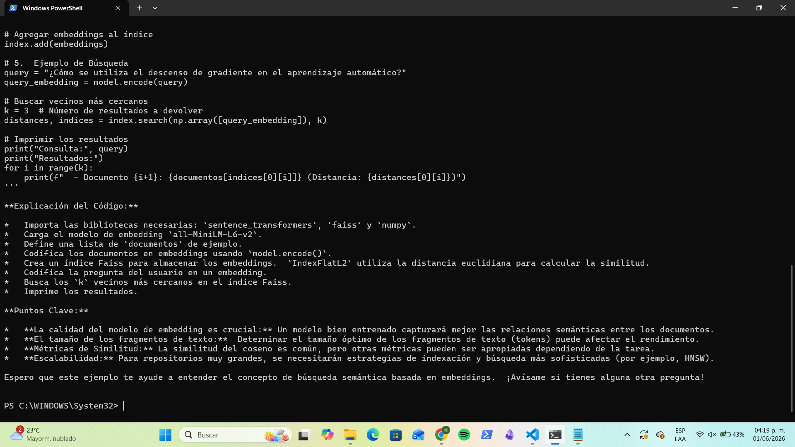
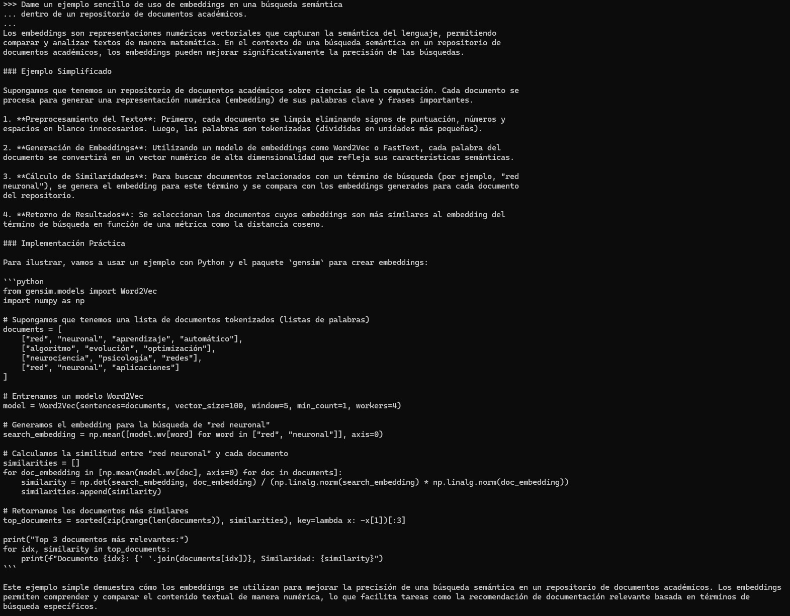
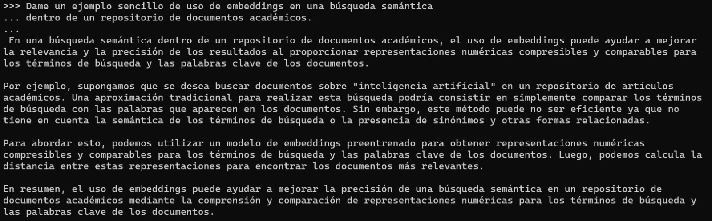
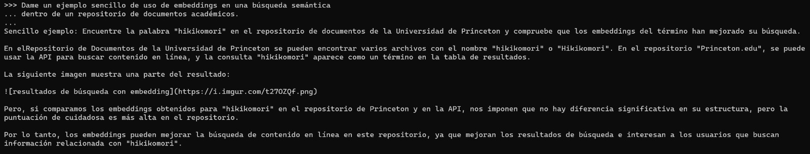

# Prompt 2 — Embeddings

## Prompt utilizado

```
Dame un ejemplo sencillo de uso de embeddings en una búsqueda semántica
dentro de un repositorio de documentos académicos.
```

---

## llama3.2:3b




**Figuras 7 y 8.** Respuesta de `llama3.2:3b` al prompt 2.

Respondió con cuatro pasos estructurados (preprocesamiento, creación de embeddings, similitud, re-ranking) y código en Python usando NumPy. El enfoque fue pedagógico y orientado al proceso paso a paso.

---

## phi3.5:latest




**Figuras 9 y 10.** Respuesta de `phi3.5:latest` al prompt 2.

Ofreció un ejemplo más completo usando `gensim` y `Word2Vec`. Incluyó representación vectorial de documentos, cálculo de similitud coseno y recuperación del documento más relevante.

---

## gemma3:4b






**Figuras 11, 12 y 13.** Respuesta de `gemma3:4b` al prompt 2.

Fue el más detallado de los modelos de 4B. Explicó el proceso en cuatro etapas e incluyó código con `sentence-transformers` y `faiss`, mencionando herramientas de nivel de producción.

---

## qwen2.5:7b



**Figura 14.** Respuesta de `qwen2.5:7b` al prompt 2.

Respondió con cuatro pasos bien diferenciados y código en Python usando `gensim` y `Word2Vec`. Fue claro en la explicación del cálculo de similitud coseno e incluyó el ranking de documentos.

---

## mistral:7b



**Figura 15.** Respuesta de `mistral:7b` al prompt 2.

Respondió sin código, con una explicación conceptual en prosa. Describió correctamente el proceso pero no incluyó un ejemplo práctico implementable. Fue el más conciso en este prompt.

---

## tinyllama:1.1b-chat-v1-q8_0



**Figura 16.** Respuesta de `tinyllama:1.1b-chat-v1-q8_0` al prompt 2.

Respondió con un ejemplo muy breve y superficial. Fabricó un enlace de imagen que no existe (alucinación). Evidencia clara de las limitaciones de los modelos de 1B para tareas que requieren precisión técnica.
