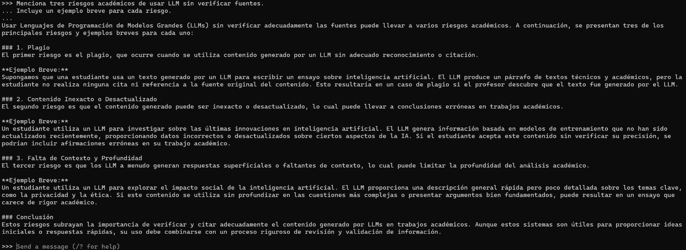
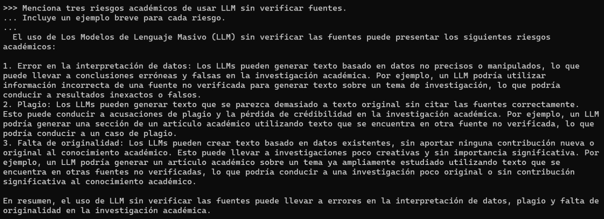
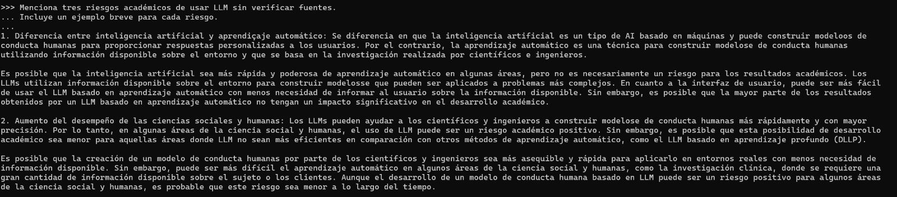

# Prompt 3 — Evaluación crítica

## Prompt utilizado

```
Menciona tres riesgos académicos de usar LLM sin verificar fuentes.
Incluye un ejemplo breve para cada riesgo.
```

---

## llama3.2:3b


**Figura 17.** Respuesta de `llama3.2:3b` al prompt 3.

Identificó: falta de contexto y precisión, plagio y falta de autenticidad, y dependencia excesiva en la tecnología. Cada riesgo incluyó un ejemplo concreto. La respuesta fue directa y bien delimitada.

---

## phi3.5:latest


**Figura 18.** Respuesta de `phi3.5:latest` al prompt 3.

Identificó: información errónea como válida, confirmación sesgada, y pérdida de habilidades críticas. Fue el único que mencionó explícitamente el riesgo del sesgo en los datos de entrenamiento. Sus ejemplos fueron los más elaborados.

---

## gemma3:4b


**Figura 19.** Respuesta de `gemma3:4b` al prompt 3.

Identificó: propagación de información falsa (alucinaciones), plagio inadvertido, y dependencia excesiva. Sus ejemplos incluyeron casos históricos específicos. Al final ofreció continuar la conversación, mostrando un comportamiento más conversacional que los demás modelos.

---

## qwen2.5:7b



**Figura 20.** Respuesta de `qwen2.5:7b` al prompt 3.

Identificó: plagio, contenido inexacto o desactualizado, y falta de contexto y profundidad. Fue el único que destacó el riesgo de datos desactualizados como problema independiente. Incluyó una conclusión que refuerza la necesidad de verificación.

---

## mistral:7b



**Figura 21.** Respuesta de `mistral:7b` al prompt 3.

Identificó: error en la interpretación de datos, plagio, y falta de originalidad. Fue el único que separó la falta de originalidad como riesgo independiente del plagio. Sus ejemplos fueron concisos pero precisos.

---

## tinyllama:1.1b-chat-v1-q8_0



**Figura 22.** Respuesta de `tinyllama:1.1b-chat-v1-q8_0` al prompt 3.

No respondió correctamente al prompt. En lugar de mencionar riesgos de usar LLM sin verificar fuentes, respondió sobre diferencias entre IA y aprendizaje automático. Es el ejemplo más evidente de alucinación temática: texto fluido pero completamente fuera de tema.
