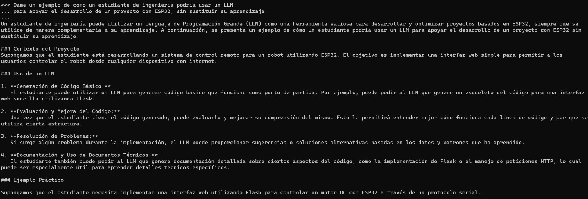
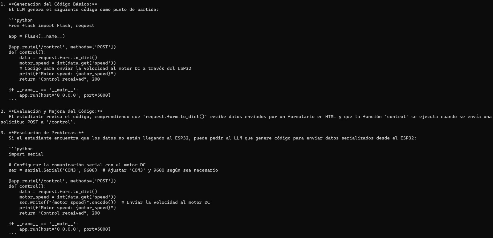
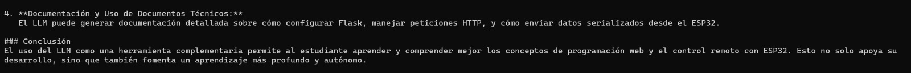
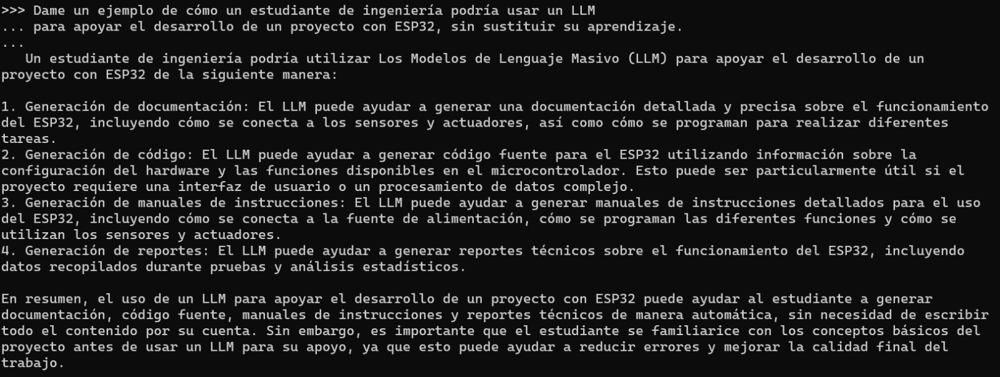
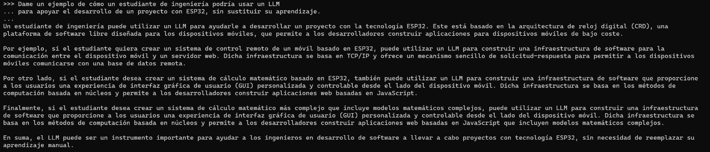

# Prompt 4 — Uso técnico

## Prompt utilizado

```
Dame un ejemplo de cómo un estudiante de ingeniería podría usar un LLM
para apoyar el desarrollo de un proyecto con ESP32, sin sustituir su aprendizaje.
```

---

## llama3.2:3b


**Figura 23.** Respuesta de `llama3.2:3b` al prompt 4.

Presentó cinco formas de uso: automatización de código, análisis de datos, documentación, simulación y colaboración. El enfoque fue en casos de uso abstractos sin desarrollar un escenario único y concreto.

---

## phi3.5:latest


**Figura 24.** Respuesta de `phi3.5:latest` al prompt 4.

Desarrolló un escenario completo de IoT con ESP32 para monitoreo ambiental, dividido en cinco fases del proyecto. Fue el más estructurado, con énfasis explícito en que el estudiante debe entender el código antes de usarlo.

---

## gemma3:4b


**Figura 25.** Respuesta de `gemma3:4b` al prompt 4.

Desarrolló un escenario de monitoreo con ESP32 y DHT22. Fue la respuesta más detallada del grupo de 4B: cuatro fases con preguntas reales al LLM, objetivos de aprendizaje explícitos y principios para usar el LLM sin sustituir el aprendizaje.

---

## qwen2.5:7b







**Figuras 26, 27 y 28.** Respuesta de `qwen2.5:7b` al prompt 4.

Fue la respuesta más extensa y técnica de todos los modelos. Desarrolló un escenario de control de motor DC con ESP32 mediante Flask e incluyó código funcional en Python. Es el único que mostró código ejecutable real como parte del ejemplo.

---

## mistral:7b



**Figura 29.** Respuesta de `mistral:7b` al prompt 4.

Respondió con cuatro formas de uso: generación de documentación, código, manuales de instrucciones y reportes técnicos. La respuesta fue clara pero genérica: no desarrolló un escenario concreto ni incluyó código.

---

## tinyllama:1.1b-chat-v1-q8_0



**Figura 30.** Respuesta de `tinyllama:1.1b-chat-v1-q8_0` al prompt 4.

Mencionó la arquitectura CRD y plataformas que no corresponden al contexto de ESP32. Generó afirmaciones técnicamente incorrectas con texto fluido, ilustrando que la coherencia superficial no garantiza corrección del contenido.
